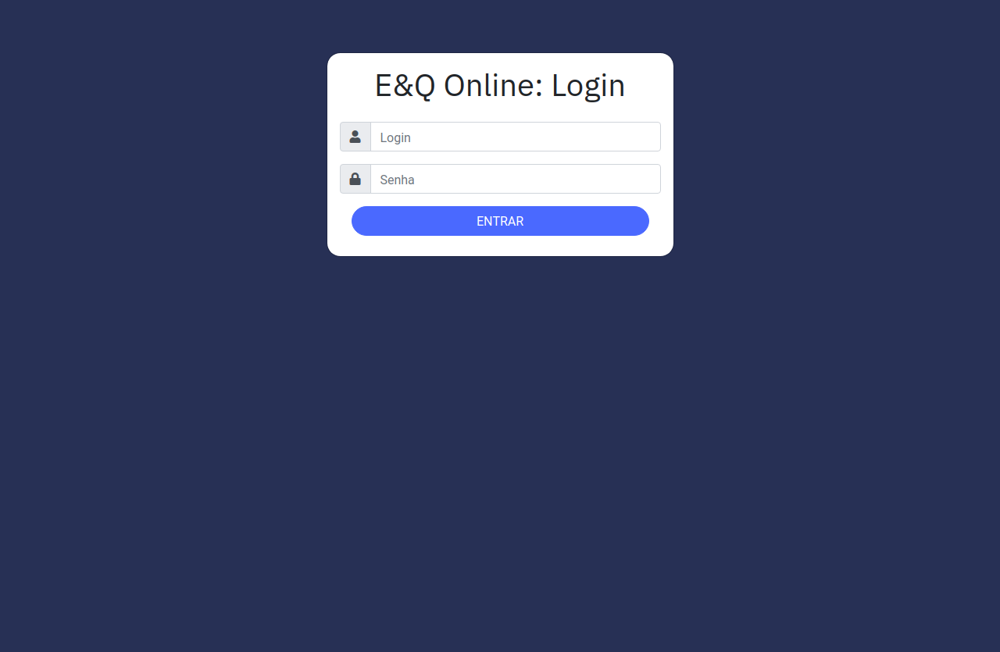
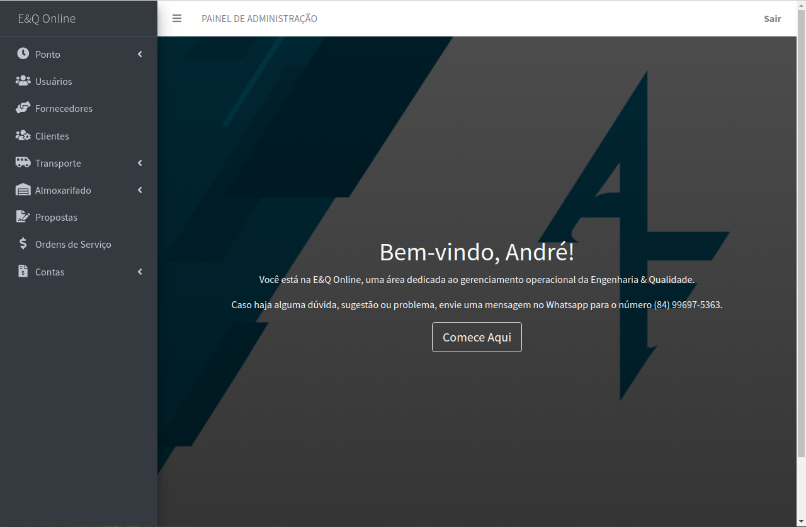
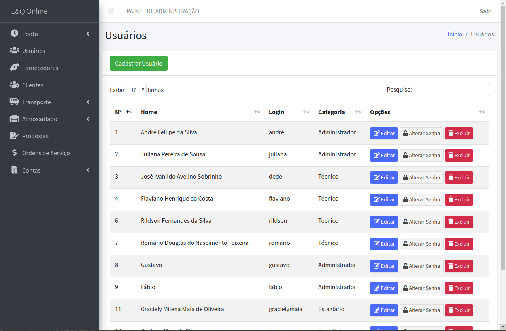
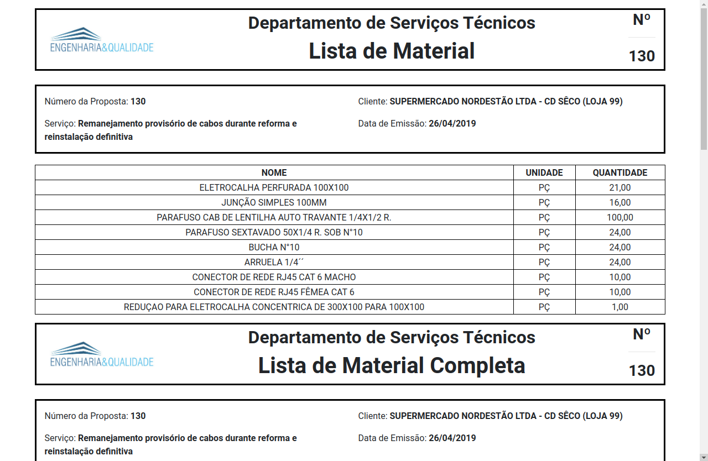

# E&Q Online

E&Q Online is a business-management web platform for the company Engenharia & Qualidade (https://www.engenhariaequalidade.com.br/). This web application contains all of the company's processes, making it easier to keep track of the data about employees, services, clients, warehouse, vehicles and finances.

The platform was made using HTML, CSS, JavaScript (jQuery), PHP and MySQL, alongside libraries like RainTPL, Composer, PHPMailer and DataTables. It's also hosted in the company's own server, as requested by the owners.

The dashboard design is an adaptation of AdminLTE (https://adminlte.io/).

